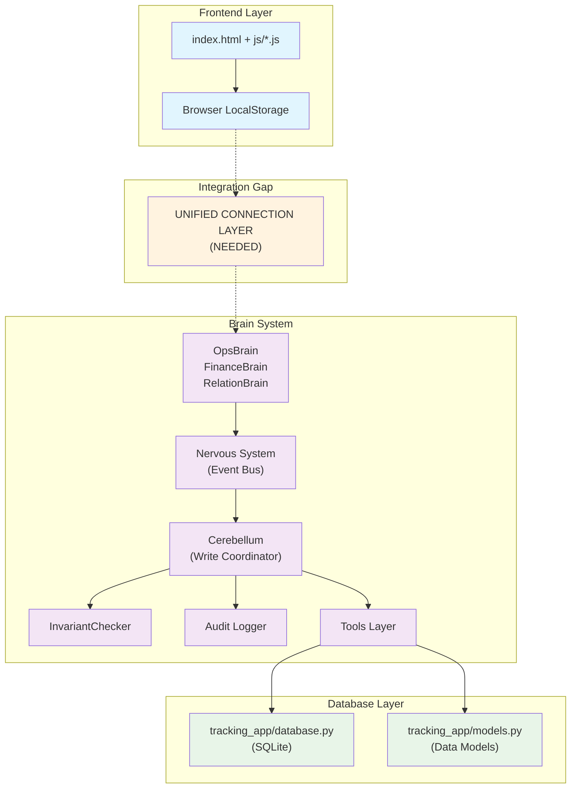
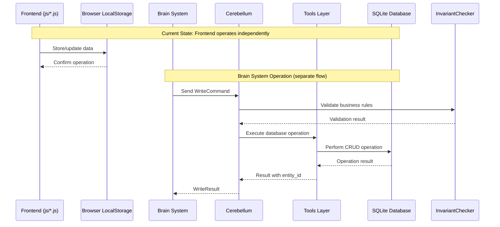

# Architectural Map for Veryfyn Tracking System

## System Overview
The Veryfyn Tracking System is a comprehensive personal tracking platform with an AI-native Brain architecture. The system consists of three main components:

1. **Frontend Layer** (`js/`, `css/`, `index.html`)
2. **Brain System** (`brain/`) - AI-native backend logic
3. **Database Layer** (`tracking_app/`) - Data persistence

## Component Relationships

### 1. Frontend Layer
- **Location**: `index.html`, `js/`, `css/`
- **Purpose**: User interface and client-side logic
- **Technologies**: Pure HTML/CSS/JavaScript (no framework dependencies)
- **Storage**: Browser LocalStorage for data persistence
- **Modules**:
  - `js/app.js` - Main application controller
  - `js/storage.js` - Data persistence layer
  - `js/habits.js` - Habits module
  - `js/tasks.js` - Tasks/Todos module
  - `js/finances.js` - Finances/Budget module
  - `js/health.js` - Health metrics module
  - `js/time.js` - Time tracking module
  - `js/goals.js` - Goals module
  - `js/achievements.js` - Achievements/gamification
  - `js/charts.js` - Chart visualization
  - `js/notifications.js` - Notification system
  - `js/dataExport.js` - Import/export functionality

### 2. Brain System
- **Location**: `brain/`
- **Purpose**: AI-native operations, command processing, policy enforcement
- **Architecture**: Follows the Brain Context Protocol
- **Components**:
  - `brain/core/` - Core brain components (router, state machine, tools)
  - `brain/tools/` - 100+ operation tools
  - `brain/policies/` - Validation policies (security, integrity)
  - `brain/state/` - State machines for entity lifecycle
  - `brain/audit/` - Logging & compliance
  - `brain/security/` - Encryption & access control
  - `brain/invariants/` - Business rules enforcement
  - `brain/immune/` - Self-healing system
  - `brain/privacy/` - Privacy features
  - `brain/fork/` - Fork engine
  - `brain/design/` - Design documentation

### 3. Database Layer
- **Location**: `tracking_app/`
- **Purpose**: Data persistence using SQLite
- **Components**:
  - `tracking_app/database.py` - Database connection and operations
  - `tracking_app/models.py` - Data models (Habit, Task, Transaction, etc.)
  - `tracking_app/storage.py` - Higher-level storage operations
  - `tracking_app/migration.py` - Database migration utilities

## Data Flow Architecture

### Frontend Event Processing
1. **User Interaction** → Frontend JavaScript modules
2. **Data Operations** → `js/storage.js` handles LocalStorage
3. **Complex Operations** → Potential Brain System integration (TBD)

### Brain Processing Pipeline
1. **Command Input** → Brain Router validates and routes commands
2. **Policy Check** → Policies check preconditions (security, integrity)
3. **State Validation** → State machines validate transitions
4. **Tool Execution** → Tools execute operations
5. **Audit Logging** → Everything is recorded in audit log
6. **Database Operations** → Interacts with tracking_app.database

### Database Integration
- The `tracking_app` provides models and database operations
- Brain system can potentially connect to `tracking_app.database`
- Frontend uses browser LocalStorage for immediate persistence
- Backend database (SQLite) for Brain operations and server-side persistence

## Integration Points

### Frontend ↔ Brain
- Currently, frontend operates independently with LocalStorage
- Brain system is designed for AI-native operations
- Integration points may exist through API endpoints (not yet implemented in current codebase)

### Brain ↔ Database
- Brain tools interact with `tracking_app.database`
- Strict execution order enforced through Brain architecture
- Policies ensure data integrity and security

### Frontend ↔ Database
- Frontend currently bypasses backend, using LocalStorage directly
- Potential for synchronization between LocalStorage and backend database

## Key Architectural Patterns

1. **Modular Architecture**: Each component is isolated with clear responsibilities
2. **Brain-First Design**: All operations flow through the Brain system
3. **Dual Persistence**: Client-side (LocalStorage) and server-side (SQLite) options
4. **Policy Enforcement**: Security and integrity policies applied at multiple layers
5. **Audit Trail**: All operations logged for compliance and debugging

## Potential Issues Identified

1. **Integration Gap**: Frontend and Brain system appear to operate independently
2. **Connection Layer**: Missing unified connection layer between modules
3. **Circular Dependencies**: Potential circular import issues in Brain modules
4. **Data Synchronization**: No clear mechanism for synchronizing LocalStorage with backend database

## Architectural Diagram

## Data Flow Sequence

